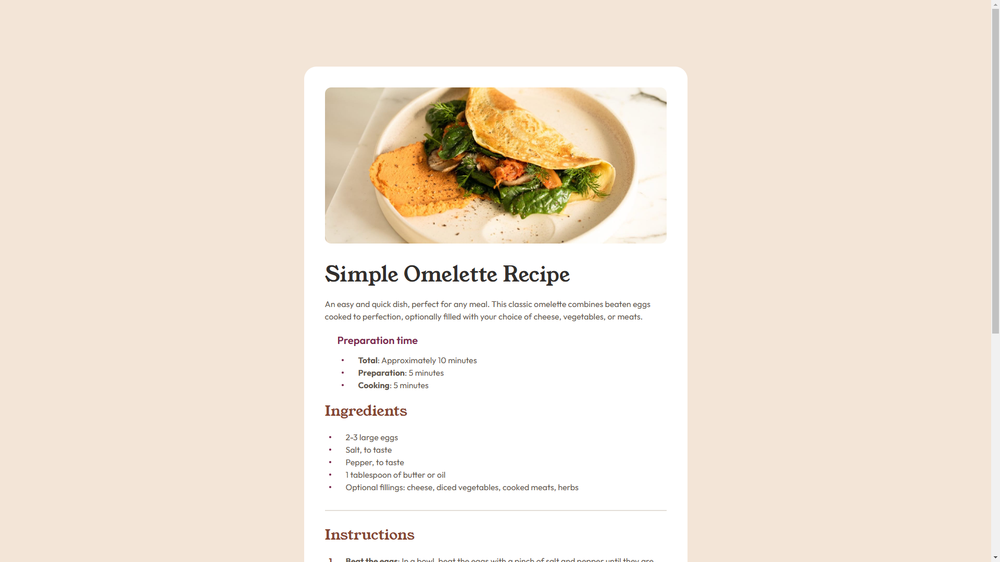

# Frontend Mentor - Recipe page solution

This is a solution to the [Recipe page challenge on Frontend Mentor](https://www.frontendmentor.io/challenges/recipe-page-KiTsR8QQKm). Frontend Mentor challenges help you improve your coding skills by building realistic projects. 

## Table of contents

- [Overview](#overview)
  - [Screenshot](#screenshot)
  - [Links](#links)
- [My process](#my-process)
  - [Built with](#built-with)
  - [What I learned](#what-i-learned)
  - [Continued development](#continued-development)

**Note: Delete this note and update the table of contents based on what sections you keep.**

## Overview

### Screenshot

### Links

- Solution URL: [CODE](https://github.com/cravsky/recipe-page)
- Live Site URL: [LIVE](https://cravsky.github.io/recipe-page/)

## My process

### Built with

- Semantic HTML5 markup
- CSS custom properties
- Flexbox
- CSS Table
- Mobile-first workflow

### What I learned

The project was a great learning opportunity. Key takeawyas:
- I learned how to syle list markers. 
- I learned that styling css table can be tricky. Margin does not work on `<tr>, <thead>, <tbody>, <tfoot>`
- I learned to pay attention to the line height.

### Continued development

In my next project I would like to pay more attention to the CSS structure. Make it modular?
